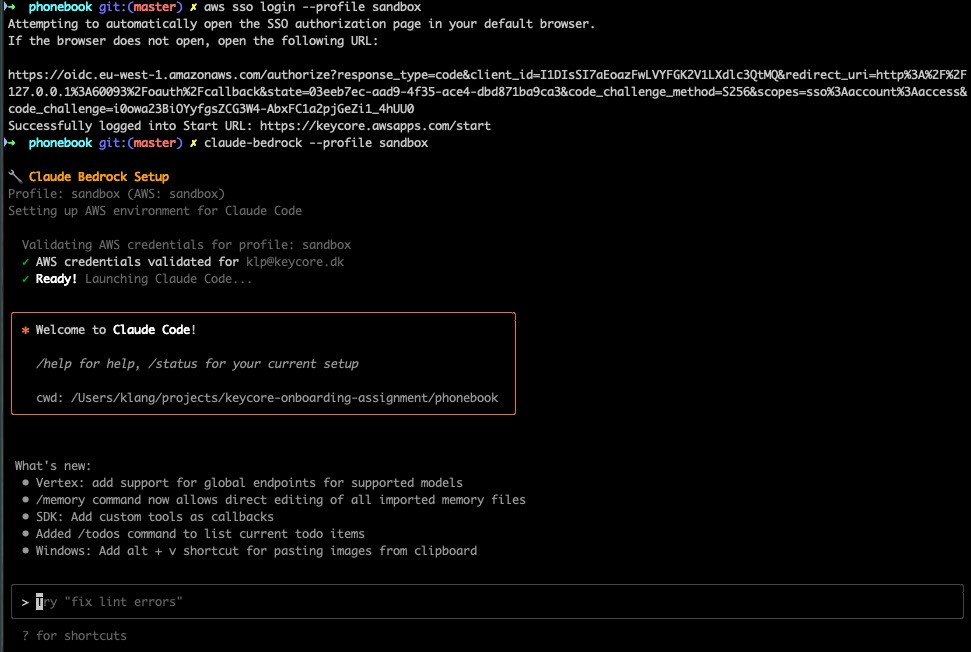
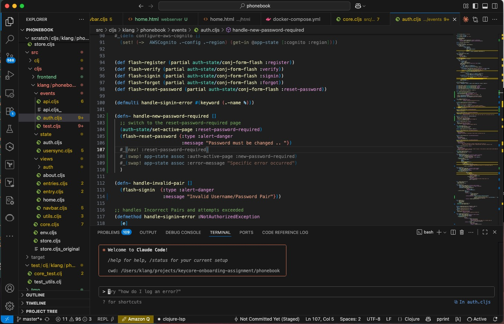

# aws configuration

Follow [the documentation](https://docs.aws.amazon.com/cli/latest/userguide/cli-configure-sso.html#sso-using-profile) for configuring sso for awscli.

After configuration, `~/.aws/config` will contain something like this:

    [sso-session keycore]
    sso_start_url = https://keycore.awsapps.com/start
    sso_region = eu-west-1
    sso_registration_scopes = sso:account:access

    [profile sandbox]
    sso_session = keycore
    sso_account_id = ACCOUNT_ID
    sso_role_name = AWSAdministratorAccess
    region = eu-west-1
    output = json

Now, it's possible to establish a connection with:

    aws sso login --profile sandbox

# claude-bedrock

The configuration file is placed in `~/.claude-bedrock`. The script will produce some sensible defaults but exact specification of `your-aws-profile` will be needed.

    # Claude Bedrock Configuration File
    # This file configures the Claude Bedrock wrapper for AWS

    [sandbox]
    aws_profile = sandbox
    aws_region = eu-west-1
    anthropic_model = eu.anthropic.claude-3-7-sonnet-20250219-v1:0
    anthropic_small_fast_model=eu.anthropic.claude-3-haiku-20240307-v1:0

The script is placed in [`~/bin/claude-bedrock`](./claude-bedrock)

The entire startup process looks something like this:

Of couse, `claude-code` just needs a terminal to run and starting it up inside vscode is a good idea.

Either way, Claude is now ready for use. 